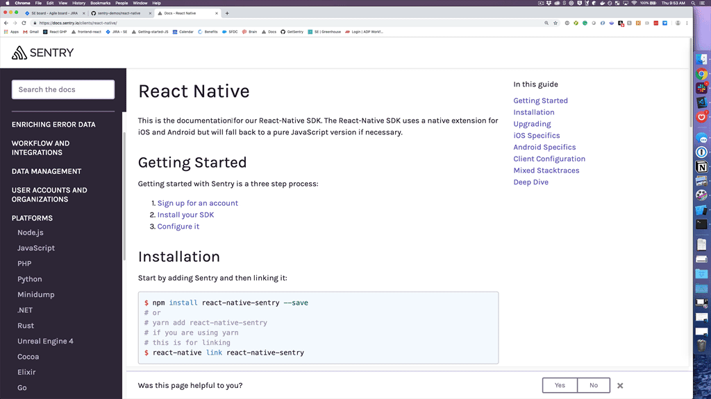
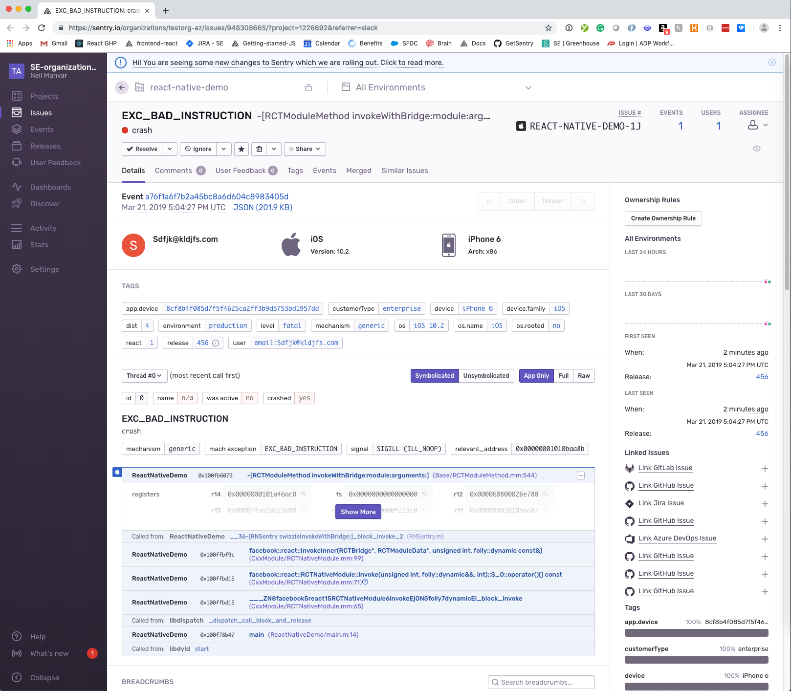

# sentry-demos/react-native
https://docs.sentry.io/clients/react-native/

## Goal/Summary:
Show how Sentry works to surface errors in react-native applications (stacktraces will be symbolicated + unminified)

## Setup
1. Create a React Native project on Sentry.io
2. Install all dependencies (node, watchmen, JDK) listed under https://facebook.github.io/react-native/docs/getting-started.html#node-watchman-jdk
3. Install cocoapods (`gem install cocoapods`)
3. Install react-native-cli: `npm install -g react-native-cli@2.0.1`
4. `cd ReactNativeDemo`
5. Use nvm version specified in .nvmrc: `nvm use`
6. Install packages: `npm install`
7. Replace DSN in App.js with project's DSN
8. Replace org and project in ios/sentry.properties + android/sentry.properties

# Run
### iOS:
```
$ react-native run-ios --configuration Release
```
### Android
```
$ react-native run-android --variant Release
```
-> Simulator/Emulator should have launched with sample app. Trigger errors and go to Sentry to see them!

# Change project
1. Replace DSN in App.js
2. Replace org and project in ios/sentry.properties + android/sentry.properties.

# GIF (JS error)


# Native crash

